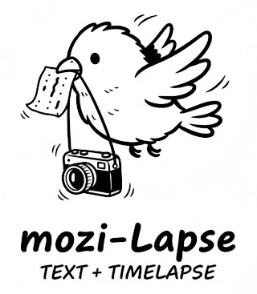

# mozi-Lapse

タイムラプス撮影した連続写真の冒頭に説明文などの文字をプラスします（モジラプス）

1.5秒間の説明動画の生成  
2.タイムラプス撮影した連続写真の動画化  
3.上記ふたつを合成してタイムラプス動画に説明文を追加するスクリプト  
#
使い方 
  
PHOTOディレクトリ内に動画化したい連続写真を入れます（20260207_071625.JPGのようなファイル名）  
mozi.txtに動画冒頭に載せたい説明文を書きます。  
./mozi-lapse.sh　を実行  
OUTディレクトリに動画が出力されます。（output.mp4）  
#
ライセンス  
このプロジェクトは MIT license の下で公開されています。
